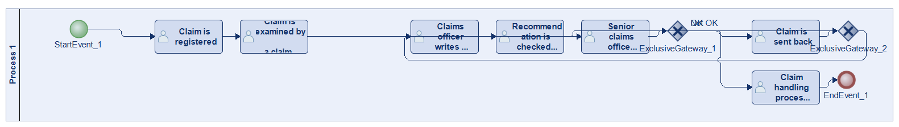
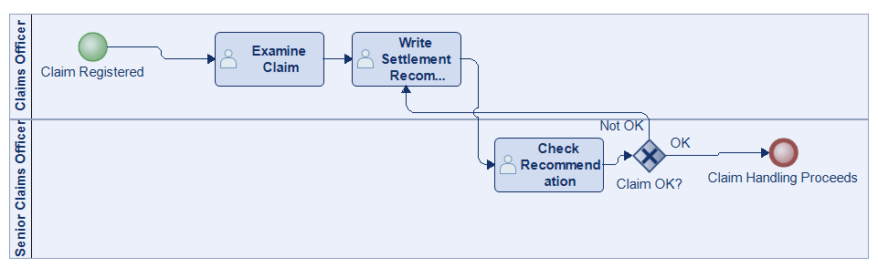
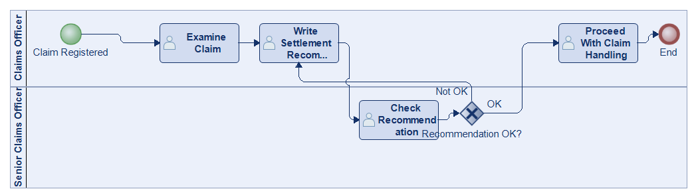
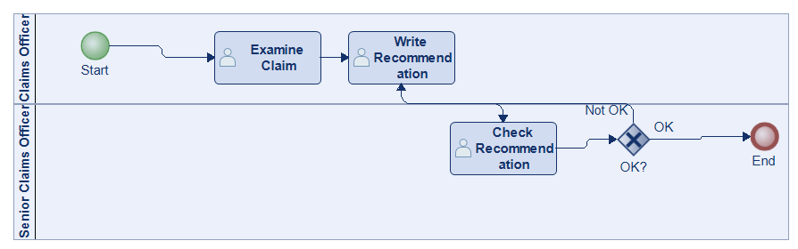
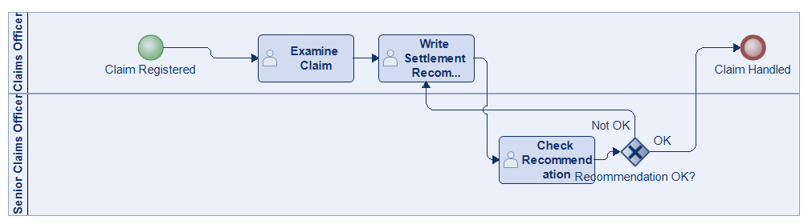
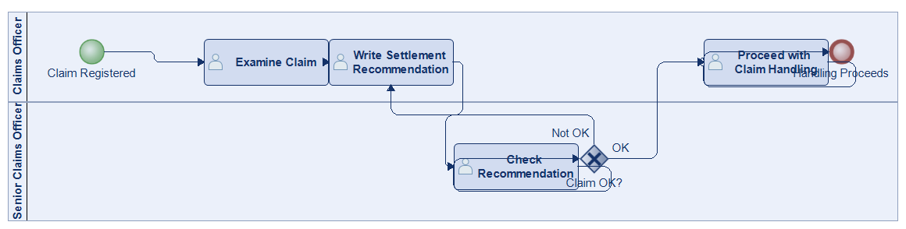
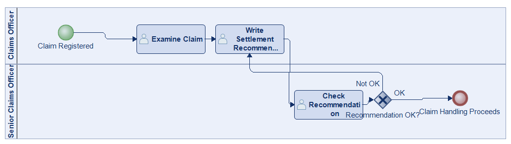

# Scenario 50

**Complexity:** Complex

[← back to comparisons index](README.md)

## Input scenario

> After a claim is registered, it is examined by a claims officer.
> The claims officer then writes a settlement recommendation.
> This recommendation is then checked by a senior claims officer who may mark the claim as OK or Not OK.
> If the claim is marked as Not OK, it is sent back to the claims officer and the recommendation is repeated.
> If the claim is OK, the claim handling process proceeds.

## Reference BPMN (ground truth)

| Lanes | Elements | Gateways | Flows | Data obj. | Data assoc. |
|--:|--:|--:|--:|--:|--:|
| 1 | 11 | 2 | 11 | 0 | 0 |

## Generated BPMN — 6 (approach × LLM) cells

Δ values in parentheses are `(generated − ground_truth)`.

### config-helpers / Claude Opus 4.5  ✅ executed

| metric | ground truth | generated | Δ |
|---|---:|---:|---:|
| Lanes | 1 | 2 | +1 |
| Elements | 11 | 6 | -5 |
| Gateways | 2 | 1 | -1 |
| Flows | 11 | 6 | -5 |
| Data obj. | 0 | — |  |
| Data assoc. | 0 | — |  |

**Generation:** 4,277 tokens · 9.9s · $0.036

### config-helpers / GPT-5.2  ✅ executed

| metric | ground truth | generated | Δ |
|---|---:|---:|---:|
| Lanes | 1 | 2 | +1 |
| Elements | 11 | 7 | -4 |
| Gateways | 2 | 1 | -1 |
| Flows | 11 | 7 | -4 |
| Data obj. | 0 | 0 | 0 |
| Data assoc. | 0 | 0 | 0 |

**Generation:** 3,813 tokens · 10.3s · $0.016

### config-helpers / GLM5  ✅ executed

| metric | ground truth | generated | Δ |
|---|---:|---:|---:|
| Lanes | 1 | 2 | +1 |
| Elements | 11 | 6 | -5 |
| Gateways | 2 | 1 | -1 |
| Flows | 11 | 6 | -5 |
| Data obj. | 0 | 0 | 0 |
| Data assoc. | 0 | 0 | 0 |

**Generation:** 5,446 tokens · 46.1s · $0.008

### no-helper / Claude Opus 4.5  ✅ executed

| metric | ground truth | generated | Δ |
|---|---:|---:|---:|
| Lanes | 1 | 2 | +1 |
| Elements | 11 | 6 | -5 |
| Gateways | 2 | 1 | -1 |
| Flows | 11 | 6 | -5 |
| Data obj. | 0 | 0 | 0 |
| Data assoc. | 0 | 0 | 0 |

**Generation:** 18,200 tokens · 56.4s · $0.207

### no-helper / GPT-5.2  ✅ executed

| metric | ground truth | generated | Δ |
|---|---:|---:|---:|
| Lanes | 1 | 2 | +1 |
| Elements | 11 | 7 | -4 |
| Gateways | 2 | 1 | -1 |
| Flows | 11 | 7 | -4 |
| Data obj. | 0 | 0 | 0 |
| Data assoc. | 0 | 0 | 0 |

**Generation:** 15,734 tokens · 61.0s · $0.096

### no-helper / GLM5  ✅ executed

| metric | ground truth | generated | Δ |
|---|---:|---:|---:|
| Lanes | 1 | 2 | +1 |
| Elements | 11 | 6 | -5 |
| Gateways | 2 | 1 | -1 |
| Flows | 11 | 6 | -5 |
| Data obj. | 0 | 0 | 0 |
| Data assoc. | 0 | 0 | 0 |

**Generation:** 15,432 tokens · 121.8s · $0.020
