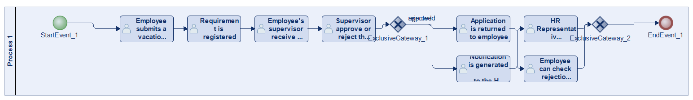
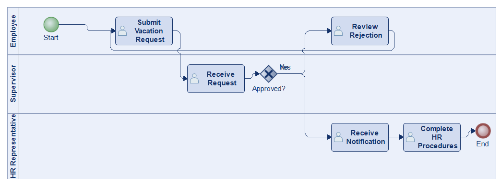
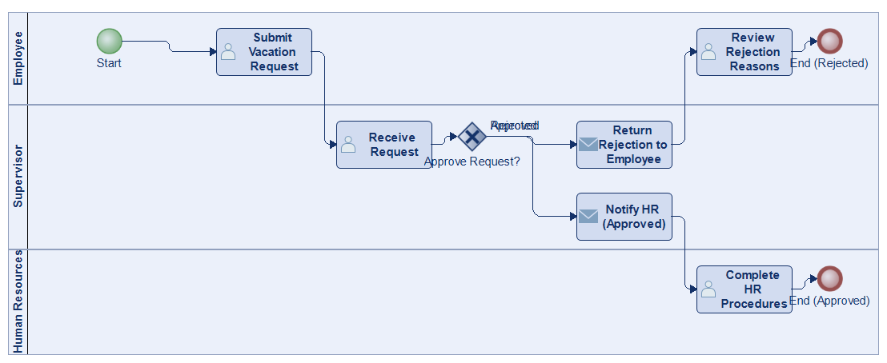
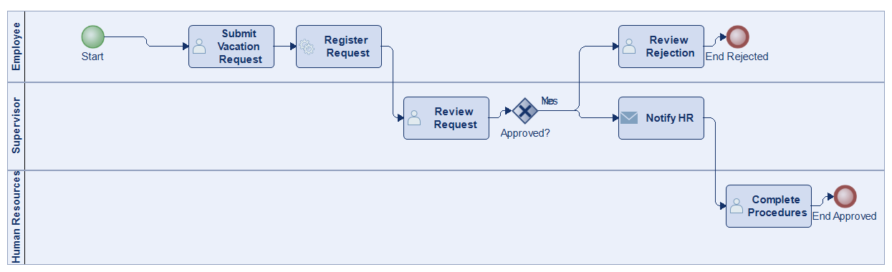
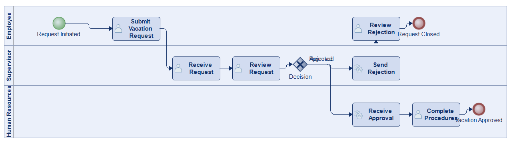
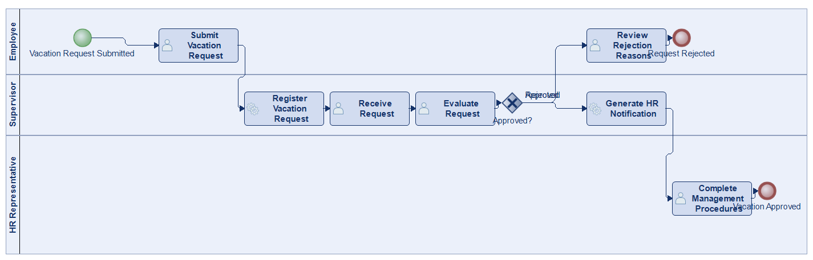
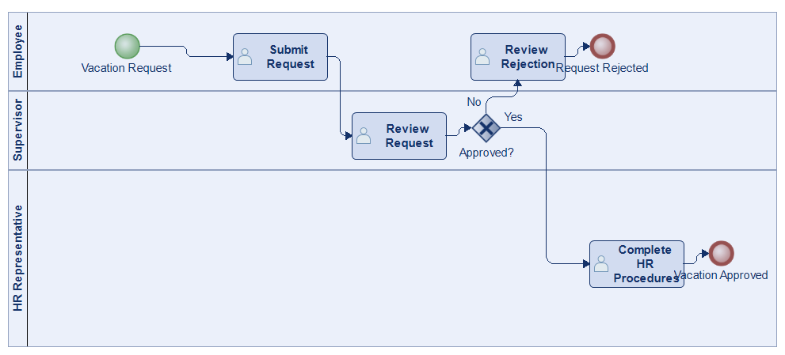

# Scenario 51

**Complexity:** Complex

[← back to comparisons index](README.md)

## Input scenario

> The process of Vacations Request starts when any employee of the organization submits a vacation request.
> Once the requirement is registered, the request is received by the immediate supervisor of the employee requesting the vacation.
> The supervisor must approve or reject the request.
> If the request is rejected, the application is returned to the applicant / employee who can review the rejection reasons.
> If the request is approved a notification is generated to the Human Resources Representative, who must complete the respective management procedures.

## Reference BPMN (ground truth)

| Lanes | Elements | Gateways | Flows | Data obj. | Data assoc. |
|--:|--:|--:|--:|--:|--:|
| 1 | 12 | 2 | 12 | 0 | 0 |

## Generated BPMN — 6 (approach × LLM) cells

Δ values in parentheses are `(generated − ground_truth)`.

### config-helpers / Claude Opus 4.5  ✅ executed

| metric | ground truth | generated | Δ |
|---|---:|---:|---:|
| Lanes | 1 | 3 | +2 |
| Elements | 12 | 8 | -4 |
| Gateways | 2 | 1 | -1 |
| Flows | 12 | 8 | -4 |
| Data obj. | 0 | — |  |
| Data assoc. | 0 | — |  |

**Generation:** 4,361 tokens · 10.8s · $0.038

### config-helpers / GPT-5.2  ✅ executed

| metric | ground truth | generated | Δ |
|---|---:|---:|---:|
| Lanes | 1 | 3 | +2 |
| Elements | 12 | 10 | -2 |
| Gateways | 2 | 1 | -1 |
| Flows | 12 | 9 | -3 |
| Data obj. | 0 | 0 | 0 |
| Data assoc. | 0 | 0 | 0 |

**Generation:** 4,110 tokens · 13.9s · $0.020

### config-helpers / GLM5  ✅ executed

| metric | ground truth | generated | Δ |
|---|---:|---:|---:|
| Lanes | 1 | 3 | +2 |
| Elements | 12 | 10 | -2 |
| Gateways | 2 | 1 | -1 |
| Flows | 12 | 9 | -3 |
| Data obj. | 0 | 0 | 0 |
| Data assoc. | 0 | 0 | 0 |

**Generation:** 6,375 tokens · 70.4s · $0.010

### no-helper / Claude Opus 4.5  ✅ executed

| metric | ground truth | generated | Δ |
|---|---:|---:|---:|
| Lanes | 1 | 3 | +2 |
| Elements | 12 | 11 | -1 |
| Gateways | 2 | 1 | -1 |
| Flows | 12 | 10 | -2 |
| Data obj. | 0 | 0 | 0 |
| Data assoc. | 0 | 0 | 0 |

**Generation:** 18,826 tokens · 64.0s · $0.222

### no-helper / GPT-5.2  ✅ executed

| metric | ground truth | generated | Δ |
|---|---:|---:|---:|
| Lanes | 1 | 3 | +2 |
| Elements | 12 | 11 | -1 |
| Gateways | 2 | 1 | -1 |
| Flows | 12 | 10 | -2 |
| Data obj. | 0 | 0 | 0 |
| Data assoc. | 0 | 0 | 0 |

**Generation:** 15,626 tokens · 55.4s · $0.094

### no-helper / GLM5  ✅ executed

| metric | ground truth | generated | Δ |
|---|---:|---:|---:|
| Lanes | 1 | 3 | +2 |
| Elements | 12 | 8 | -4 |
| Gateways | 2 | 1 | -1 |
| Flows | 12 | 7 | -5 |
| Data obj. | 0 | 0 | 0 |
| Data assoc. | 0 | 0 | 0 |

**Generation:** 15,943 tokens · 88.5s · $0.021
