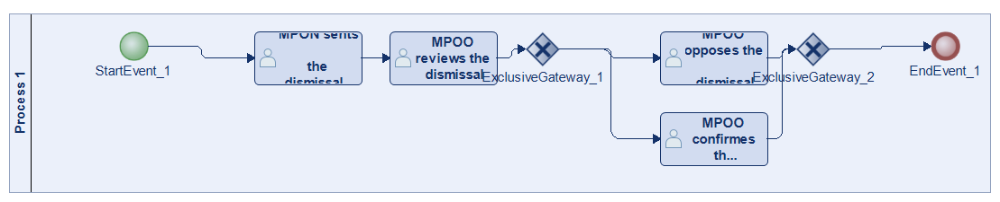
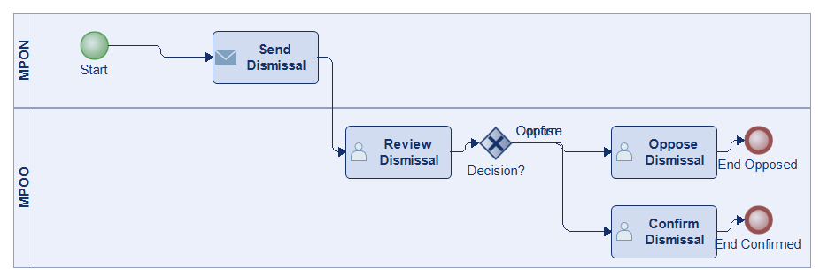
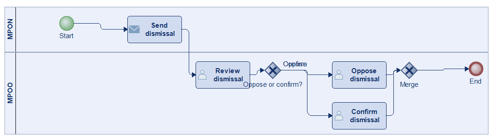
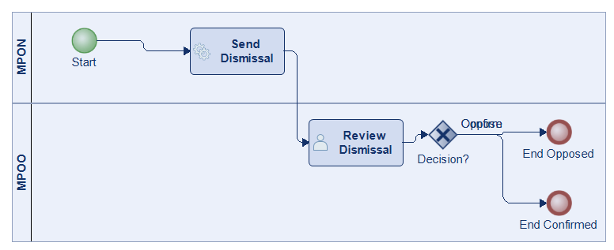
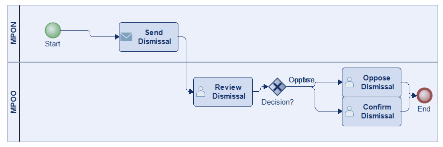
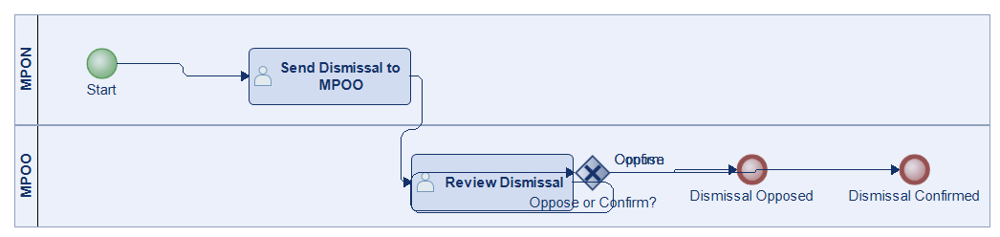
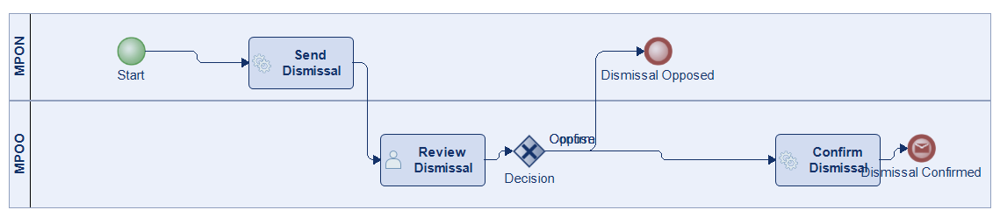

# Scenario 52

**Complexity:** Complex

[← back to comparisons index](README.md)

## Input scenario

> The MPON sents the dismissal to the MPOO.
> The MPOO reviews the dismissal.
> The MPOO opposes the dismissal of MPON or the MPOO confirmes the dismissal of the MPON.

## Reference BPMN (ground truth)

| Lanes | Elements | Gateways | Flows | Data obj. | Data assoc. |
|--:|--:|--:|--:|--:|--:|
| 1 | 8 | 2 | 8 | 0 | 0 |

## Generated BPMN — 6 (approach × LLM) cells

Δ values in parentheses are `(generated − ground_truth)`.

### config-helpers / Claude Opus 4.5  ✅ executed

| metric | ground truth | generated | Δ |
|---|---:|---:|---:|
| Lanes | 1 | 2 | +1 |
| Elements | 8 | 8 | 0 |
| Gateways | 2 | 1 | -1 |
| Flows | 8 | 7 | -1 |
| Data obj. | 0 | — |  |
| Data assoc. | 0 | — |  |

**Generation:** 4,387 tokens · 11.5s · $0.039

### config-helpers / GPT-5.2  ✅ executed

| metric | ground truth | generated | Δ |
|---|---:|---:|---:|
| Lanes | 1 | 2 | +1 |
| Elements | 8 | 8 | 0 |
| Gateways | 2 | 2 | 0 |
| Flows | 8 | 8 | 0 |
| Data obj. | 0 | 0 | 0 |
| Data assoc. | 0 | 0 | 0 |

**Generation:** 3,770 tokens · 13.0s · $0.016

### config-helpers / GLM5  ✅ executed

| metric | ground truth | generated | Δ |
|---|---:|---:|---:|
| Lanes | 1 | 2 | +1 |
| Elements | 8 | 6 | -2 |
| Gateways | 2 | 1 | -1 |
| Flows | 8 | 5 | -3 |
| Data obj. | 0 | 0 | 0 |
| Data assoc. | 0 | 0 | 0 |

**Generation:** 4,611 tokens · 37.6s · $0.006

### no-helper / Claude Opus 4.5  ✅ executed

| metric | ground truth | generated | Δ |
|---|---:|---:|---:|
| Lanes | 1 | 2 | +1 |
| Elements | 8 | 7 | -1 |
| Gateways | 2 | 1 | -1 |
| Flows | 8 | 7 | -1 |
| Data obj. | 0 | 0 | 0 |
| Data assoc. | 0 | 0 | 0 |

**Generation:** 18,601 tokens · 60.9s · $0.217

### no-helper / GPT-5.2  ✅ executed

| metric | ground truth | generated | Δ |
|---|---:|---:|---:|
| Lanes | 1 | 2 | +1 |
| Elements | 8 | 6 | -2 |
| Gateways | 2 | 1 | -1 |
| Flows | 8 | 5 | -3 |
| Data obj. | 0 | 0 | 0 |
| Data assoc. | 0 | 0 | 0 |

**Generation:** 14,951 tokens · 51.5s · $0.085

### no-helper / GLM5  ✅ executed

| metric | ground truth | generated | Δ |
|---|---:|---:|---:|
| Lanes | 1 | 2 | +1 |
| Elements | 8 | 7 | -1 |
| Gateways | 2 | 1 | -1 |
| Flows | 8 | 6 | -2 |
| Data obj. | 0 | 0 | 0 |
| Data assoc. | 0 | 0 | 0 |

**Generation:** 15,056 tokens · 77.7s · $0.019
