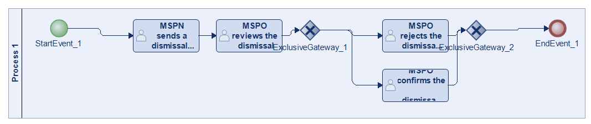
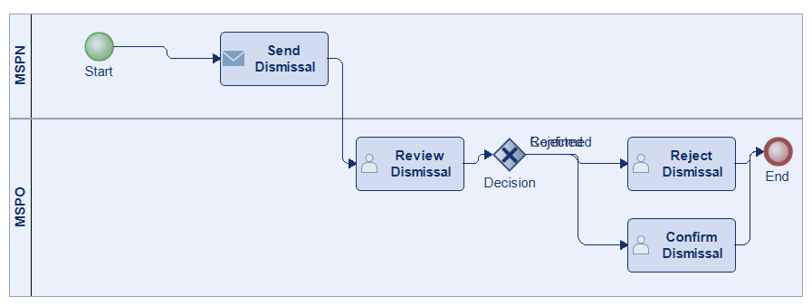
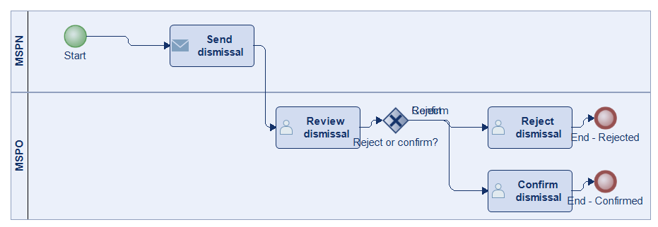
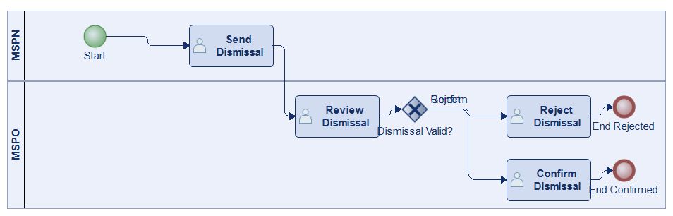
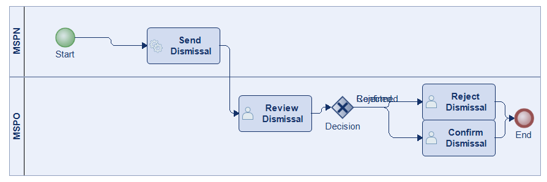
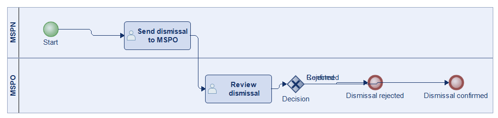
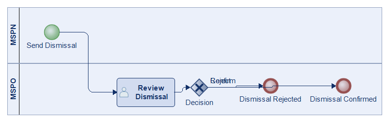

# Scenario 53

**Complexity:** Complex

[← back to comparisons index](README.md)

## Input scenario

> The MSPN sends a dismissal to the MSPO.
> The MSPO reviews the dismissal.
> The MSPO rejects the dismissal of the MSPN or The MSPO confirms the dismissal of the MSPN.

## Reference BPMN (ground truth)

| Lanes | Elements | Gateways | Flows | Data obj. | Data assoc. |
|--:|--:|--:|--:|--:|--:|
| 1 | 8 | 2 | 8 | 0 | 0 |

## Generated BPMN — 6 (approach × LLM) cells

Δ values in parentheses are `(generated − ground_truth)`.

### config-helpers / Claude Opus 4.5  ✅ executed

| metric | ground truth | generated | Δ |
|---|---:|---:|---:|
| Lanes | 1 | 2 | +1 |
| Elements | 8 | 7 | -1 |
| Gateways | 2 | 1 | -1 |
| Flows | 8 | 7 | -1 |
| Data obj. | 0 | — |  |
| Data assoc. | 0 | — |  |

**Generation:** 4,438 tokens · 11.5s · $0.041

### config-helpers / GPT-5.2  ✅ executed

| metric | ground truth | generated | Δ |
|---|---:|---:|---:|
| Lanes | 1 | 2 | +1 |
| Elements | 8 | 8 | 0 |
| Gateways | 2 | 1 | -1 |
| Flows | 8 | 7 | -1 |
| Data obj. | 0 | 0 | 0 |
| Data assoc. | 0 | 0 | 0 |

**Generation:** 4,106 tokens · 13.6s · $0.021

### config-helpers / GLM5  ✅ executed

| metric | ground truth | generated | Δ |
|---|---:|---:|---:|
| Lanes | 1 | 2 | +1 |
| Elements | 8 | 8 | 0 |
| Gateways | 2 | 1 | -1 |
| Flows | 8 | 7 | -1 |
| Data obj. | 0 | 0 | 0 |
| Data assoc. | 0 | 0 | 0 |

**Generation:** 4,585 tokens · 14.9s · $0.006

### no-helper / Claude Opus 4.5  ✅ executed

| metric | ground truth | generated | Δ |
|---|---:|---:|---:|
| Lanes | 1 | 2 | +1 |
| Elements | 8 | 7 | -1 |
| Gateways | 2 | 1 | -1 |
| Flows | 8 | 7 | -1 |
| Data obj. | 0 | 0 | 0 |
| Data assoc. | 0 | 0 | 0 |

**Generation:** 18,795 tokens · 62.3s · $0.222

### no-helper / GPT-5.2  ✅ executed

| metric | ground truth | generated | Δ |
|---|---:|---:|---:|
| Lanes | 1 | 2 | +1 |
| Elements | 8 | 6 | -2 |
| Gateways | 2 | 1 | -1 |
| Flows | 8 | 5 | -3 |
| Data obj. | 0 | 0 | 0 |
| Data assoc. | 0 | 0 | 0 |

**Generation:** 15,005 tokens · 50.2s · $0.086

### no-helper / GLM5  ✅ executed

| metric | ground truth | generated | Δ |
|---|---:|---:|---:|
| Lanes | 1 | 2 | +1 |
| Elements | 8 | 5 | -3 |
| Gateways | 2 | 1 | -1 |
| Flows | 8 | 4 | -4 |
| Data obj. | 0 | 0 | 0 |
| Data assoc. | 0 | 0 | 0 |

**Generation:** 15,417 tokens · 81.3s · $0.020
