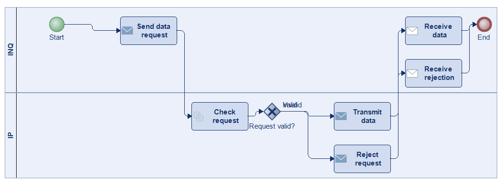
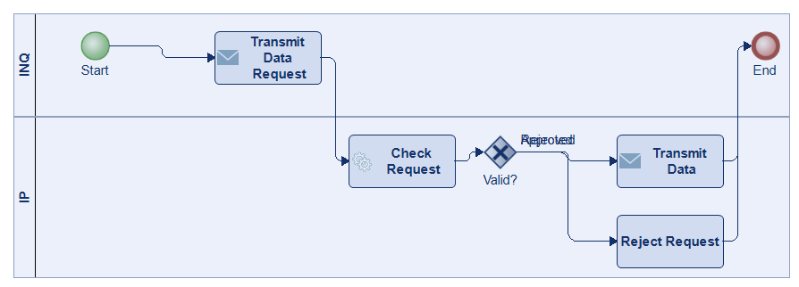
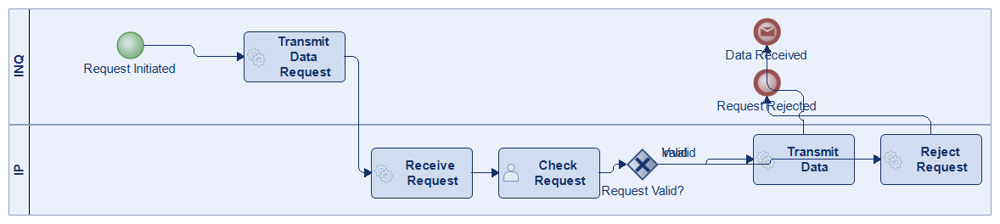
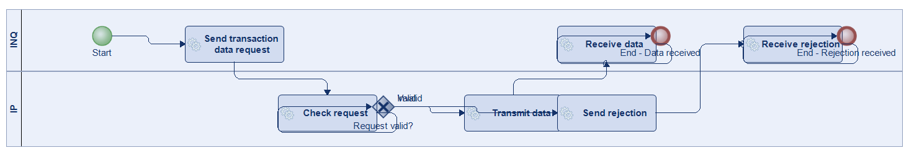
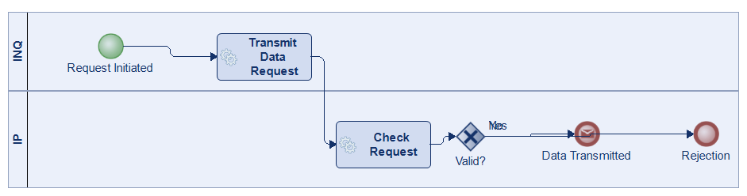

# Scenario 54

**Complexity:** Simple

[← back to comparisons index](README.md)

## Input scenario

> The INQ transmits the transaction data request to the IP.
> The IP checks the request of the INQ.
> The IP answers the question of the INQ depending on the outcome of the examination, i.e. Transmission of data or rejection.

## Reference BPMN (ground truth)

| Lanes | Elements | Gateways | Flows | Data obj. | Data assoc. |
|--:|--:|--:|--:|--:|--:|
| 1 | 5 | 0 | 4 | 0 | 0 |

## Generated BPMN — 6 (approach × LLM) cells

Δ values in parentheses are `(generated − ground_truth)`.

### config-helpers / Claude Opus 4.5  ✅ executed

| metric | ground truth | generated | Δ |
|---|---:|---:|---:|
| Lanes | 1 | 2 | +1 |
| Elements | 5 | 11 | +6 |
| Gateways | 0 | 1 | +1 |
| Flows | 4 | 10 | +6 |
| Data obj. | 0 | — |  |
| Data assoc. | 0 | — |  |

**Generation:** 4,716 tokens · 16.0s · $0.048

### config-helpers / GPT-5.2  ✅ executed

| metric | ground truth | generated | Δ |
|---|---:|---:|---:|
| Lanes | 1 | 2 | +1 |
| Elements | 5 | 9 | +4 |
| Gateways | 0 | 1 | +1 |
| Flows | 4 | 9 | +5 |
| Data obj. | 0 | 0 | 0 |
| Data assoc. | 0 | 0 | 0 |

**Generation:** 3,936 tokens · 12.5s · $0.018

### config-helpers / GLM5  ✅ executed

| metric | ground truth | generated | Δ |
|---|---:|---:|---:|
| Lanes | 1 | 2 | +1 |
| Elements | 5 | 7 | +2 |
| Gateways | 0 | 1 | +1 |
| Flows | 4 | 7 | +3 |
| Data obj. | 0 | 0 | 0 |
| Data assoc. | 0 | 0 | 0 |

**Generation:** 5,134 tokens · 38.3s · $0.007

### no-helper / Claude Opus 4.5  ✅ executed

| metric | ground truth | generated | Δ |
|---|---:|---:|---:|
| Lanes | 1 | 2 | +1 |
| Elements | 5 | 9 | +4 |
| Gateways | 0 | 1 | +1 |
| Flows | 4 | 8 | +4 |
| Data obj. | 0 | 0 | 0 |
| Data assoc. | 0 | 0 | 0 |

**Generation:** 19,037 tokens · 66.2s · $0.228

### no-helper / GPT-5.2  ✅ executed

| metric | ground truth | generated | Δ |
|---|---:|---:|---:|
| Lanes | 1 | 2 | +1 |
| Elements | 5 | 10 | +5 |
| Gateways | 0 | 1 | +1 |
| Flows | 4 | 9 | +5 |
| Data obj. | 0 | 0 | 0 |
| Data assoc. | 0 | 0 | 0 |

**Generation:** 16,986 tokens · 82.2s · $0.114

### no-helper / GLM5  ✅ executed

| metric | ground truth | generated | Δ |
|---|---:|---:|---:|
| Lanes | 1 | 2 | +1 |
| Elements | 5 | 6 | +1 |
| Gateways | 0 | 1 | +1 |
| Flows | 4 | 5 | +1 |
| Data obj. | 0 | 0 | 0 |
| Data assoc. | 0 | 0 | 0 |

**Generation:** 14,674 tokens · 89.3s · $0.018
