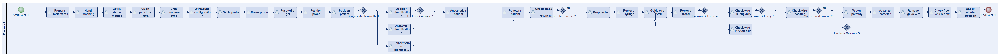
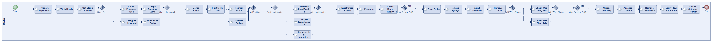
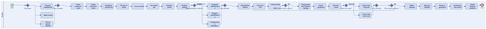
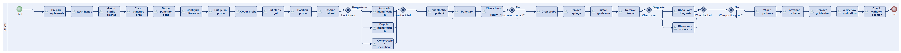
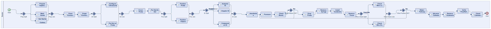
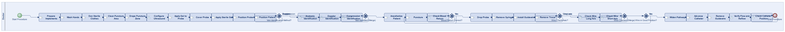
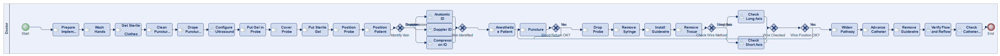

# Scenario 55

**Complexity:** Complex

[← back to comparisons index](README.md)

## Input scenario

> First, the implements are prepared, the hands are washed, and the doctor gets in sterile clothes.
> The doctor cleans the puncture area, and drapes the puncture zone.
> The doctor configures the ultrasound, and puts gel in the probe.
> Then, the doctor covers the probe and puts the sterile gel.
> The doctor positions the probe and positions the patient.
> The vein is identified using an anatomic identification, a doppler identification, or a compression identification.
> The patient is anesthetize and punctured.
> The blood return is checked.
> If the blood return is not correct, the doctor goes back to the puncture step.
> If the blood return is correct, the probe is dropped and the syringe is removed.
> The guidewire is installed, and the trocar is removed.
> Then the wire is checked using a check of the wire in the long axis, or a check of the wire in the short axis.
> Then, the doctor checks if the wire is in good position.
> If the wire is not in the good position, the doctor goes back to the puncture step.
> If the wire is in the good position, the pathway is widen, the catheter is advanced, and the guirewire is removed.
> Finally, the doctor verifies the flow and the reflow, and the catheter position is checked.

## Reference BPMN (ground truth)

| Lanes | Elements | Gateways | Flows | Data obj. | Data assoc. |
|--:|--:|--:|--:|--:|--:|
| 1 | 38 | 7 | 42 | 0 | 0 |

## Generated BPMN — 6 (approach × LLM) cells

Δ values in parentheses are `(generated − ground_truth)`.

### config-helpers / Claude Opus 4.5  ✅ executed

| metric | ground truth | generated | Δ |
|---|---:|---:|---:|
| Lanes | 1 | 1 | 0 |
| Elements | 38 | 39 | +1 |
| Gateways | 7 | 9 | +2 |
| Flows | 42 | 45 | +3 |
| Data obj. | 0 | — |  |
| Data assoc. | 0 | — |  |

**Generation:** 6,168 tokens · 22.7s · $0.079

### config-helpers / GPT-5.2  ✅ executed

| metric | ground truth | generated | Δ |
|---|---:|---:|---:|
| Lanes | 1 | 1 | 0 |
| Elements | 38 | 37 | -1 |
| Gateways | 7 | 8 | +1 |
| Flows | 42 | 43 | +1 |
| Data obj. | 0 | 0 | 0 |
| Data assoc. | 0 | 0 | 0 |

**Generation:** 6,103 tokens · 34.0s · $0.046

### config-helpers / GLM5  ✅ executed

| metric | ground truth | generated | Δ |
|---|---:|---:|---:|
| Lanes | 1 | 1 | 0 |
| Elements | 38 | 36 | -2 |
| Gateways | 7 | 6 | -1 |
| Flows | 42 | 40 | -2 |
| Data obj. | 0 | 0 | 0 |
| Data assoc. | 0 | 0 | 0 |

**Generation:** 12,382 tokens · 80.3s · $0.023

### no-helper / Claude Opus 4.5  ✅ executed

| metric | ground truth | generated | Δ |
|---|---:|---:|---:|
| Lanes | 1 | 1 | 0 |
| Elements | 38 | 42 | +4 |
| Gateways | 7 | 12 | +5 |
| Flows | 42 | 50 | +8 |
| Data obj. | 0 | 0 | 0 |
| Data assoc. | 0 | 0 | 0 |

**Generation:** 20,127 tokens · 72.1s · $0.251

### no-helper / GPT-5.2  ✅ executed

| metric | ground truth | generated | Δ |
|---|---:|---:|---:|
| Lanes | 1 | 1 | 0 |
| Elements | 38 | 36 | -2 |
| Gateways | 7 | 6 | -1 |
| Flows | 42 | 40 | -2 |
| Data obj. | 0 | 0 | 0 |
| Data assoc. | 0 | 0 | 0 |

**Generation:** 18,117 tokens · 80.5s · $0.127

### no-helper / GLM5  ✅ executed

| metric | ground truth | generated | Δ |
|---|---:|---:|---:|
| Lanes | 1 | 1 | 0 |
| Elements | 38 | 35 | -3 |
| Gateways | 7 | 6 | -1 |
| Flows | 42 | 39 | -3 |
| Data obj. | 0 | 0 | 0 |
| Data assoc. | 0 | 0 | 0 |

**Generation:** 20,533 tokens · 149.5s · $0.031
