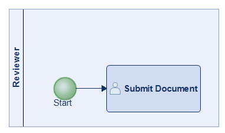

# Preliminary evaluation — one-shot generation baseline

This folder documents the **pilot evaluation** that motivated the
Config+Helpers approach. It is the evidence base for paper §2.2
*"Motivating Scenario in MATISSE"* and the failure-mode discussion in
§6 *"Lessons Learned and Guidelines"*. It addresses
**Reviewer 2's Q4** ("Could you please provide more information about
the preliminary tests?") and meta-review point 1.

Distinct from the published 55-scenario PMo benchmark in
[`../runs/`](../runs/): different scope, different LLM set, different
purpose. The PMo benchmark is the artifact-of-record for the paper's
quantitative tables; this folder explains *why we went down that road
in the first place*.

## What's here

```
preliminary_tests/
├── README.md                            ← you are here
├── methodology.md                       Trimmed experimental design (Exp 1 only)
├── prompts/                             The three scenario prompts (S1, M1, C1)
├── modelio_api_examples/                Modelio OSS sample macros given to the LLMs
│   ├── README.md                          ← what they are and why they're committed here
│   ├── MakeSingleton.py
│   └── Sort.py
└── results/
    ├── narrative.md                     Full round-by-round source narrative
    ├── scripts/                         All 10 generated Jython scripts (verbatim)
    └── screenshots/                     The 2 converged-diagram screenshots
```

## LLMs and scenarios

| LLM             | Version              | Test budget (S1) |
|-----------------|----------------------|------------------|
| Claude Opus 4.5 | Anthropic, Dec 2025  | 5 rounds         |
| GPT-5.2 Thinking| OpenAI, Dec 2025     | 2 rounds         |
| Gemini Pro 3.1  | Google, Dec 2025     | 9 rounds         |

| Scenario | Complexity | Lanes | Elements | Round-by-round data? |
|----------|------------|------:|---------:|----------------------|
| **S1** — Document Approval   | Simple  | 1 | 4   | ✅ all three LLMs |
| **M1** — Leave Request       | Medium  | 2 | ~10 | one Claude attempt only |
| **C1** — Hiring Process      | Complex | 4 | ~17 | one Claude attempt only |

The full per-LLM × per-scenario prompts are in
[`prompts/`](prompts/).

## The two conditions

The experiment's independent variable is whether sample Modelio macros
were attached to the LLM context. From paper §2.2:

> "Without providing any Modelio API examples, all three models failed
> completely (0% success rate). […] **By adding working example
> scripts in the LLM context**, GPT succeeded in creating a BPMN model
> on its first attempt but the generated layout information was
> corrupted."

| Condition         | What the LLM saw                                                                            |
|-------------------|---------------------------------------------------------------------------------------------|
| **Zero-shot**     | System prompt + scenario prompt only.                                                       |
| **With API examples** | System prompt + scenario prompt + `MakeSingleton.py` + `Sort.py` attached as context.    |

The two attached files are Modelio's own sample macros, shipped with
Modelio Open Source. See
[`modelio_api_examples/README.md`](modelio_api_examples/README.md) for
their provenance and what each one demonstrates about the Modelio API.

## Results — per-LLM × per-round (S1)

| LLM     | Round | Condition         | Outcome                              | Script                                                       |
|---------|------:|-------------------|--------------------------------------|--------------------------------------------------------------|
| Claude  | 1     | Zero-shot         | ❌ ImportError on hallucinated import | [`s1_claude.py`](results/scripts/s1_claude.py) (267 LOC)     |
| Claude  | 2     | With examples     | ❌ First with-examples attempt failed | [`s1_claude_r2.py`](results/scripts/s1_claude_r2.py)         |
| Claude  | 3     | With examples + error feedback | ❌ `AttributeError: 'BpmnStartEv' object has no attribute 'setLane'` | — |
| Claude  | 4     | With examples + error feedback | ❌ `AttributeError: 'DiagramService' object has no attribute 'createDiagram'` | — |
| Claude  | 5     | With examples + error feedback | ✅ **Model OK, layout broken** (191 LOC) | [`s1_claude_r5.py`](results/scripts/s1_claude_r5.py)     |
| GPT-5.2 | 1     | Zero-shot         | ❌ Encoding declaration rejected by Jython | [`s1_gpt5.py`](results/scripts/s1_gpt5.py) (204 LOC)    |
| GPT-5.2 | 2     | With examples     | ✅ **Model OK, layout broken** (first try) | [`s1_gpt5_r2.py`](results/scripts/s1_gpt5_r2.py)         |
| Gemini  | 1     | Zero-shot         | ❌ ImportError on hallucinated import | [`s1_gemini.py`](results/scripts/s1_gemini.py) (148 LOC)     |
| Gemini  | 2     | With examples     | ❌ First with-examples attempt failed | [`s1_gemini_r2.py`](results/scripts/s1_gemini_r2.py)         |
| Gemini  | 3–8   | With examples + error feedback | ❌ Spiral: factory→constructor→reflection misuse | — |
| Gemini  | 9     | With examples + error feedback | ❌ **Abandoned** — still on reflection (169 LOC) | [`s1_gemini_r9.py`](results/scripts/s1_gemini_r9.py) |

> **"Model OK, layout broken"** means the script executed and the BPMN
> process appeared in Modelio's model tree, but the diagram itself was
> visually corrupted by Modelio's auto-unmask non-determinism. This is
> a Modelio-side issue, not an LLM-side issue — it's exactly the
> problem the helper library in [`../../approaches/config-helpers/BPMN_Helpers.py`](../../approaches/config-helpers/BPMN_Helpers.py)
> was later built to absorb. See [`../../docs/LAYOUT_RULES.md`](../../docs/LAYOUT_RULES.md).

The full narrative — Modelio output for every round, the specific API
fix per attempt, and the reasoning trace — lives in
[`results/narrative.md`](results/narrative.md).

For M1 and C1, only one Claude attempt was captured each:
[`results/scripts/m1_claude.py`](results/scripts/m1_claude.py) and
[`results/scripts/c1_claude.py`](results/scripts/c1_claude.py).
No round-by-round outcome was recorded for those.

## Converged diagrams

The two runs that produced a working BPMN model (Claude S1 r5 and
GPT-5.2 S1 r2) — both showing the corrupted-layout problem this
preliminary work uncovered.

**Claude Opus 4.5 — S1, round 5:**


**GPT-5.2 — S1, round 2:**



## Failure-mode taxonomy

Paper §6 *"Lessons Learned and Guidelines"* names three recurring
failure modes for one-shot generation of complex models. Each is
substantiated below with a concrete example from
[`results/scripts/`](results/scripts/).

### 1. Wrong imports

> *"…200+ lines of code present many potential failure points,
> including wrong imports…"* — paper §6

Both Claude and Gemini, in their zero-shot round, generated `from
org.modelio.api.model import Model`-style imports that don't
exist. Concrete instances:

- [`s1_claude.py`](results/scripts/s1_claude.py) (Claude r1): `ImportError: No module named model in <script> at line number 6`.
- [`s1_gemini.py`](results/scripts/s1_gemini.py) (Gemini r1): `ImportError: No module named model in <script> at line number 1`.

### 2. API version mismatches

> *"…API version mismatches…"* — paper §6

Even with examples in context, multiple plausible-but-wrong method
names appeared:

- `element.setLane(lane)` (Claude r2–r3) — Lane membership is
  *parent-to-child*; the correct call is
  `lane.getFlowElementRef().add(element)`.
- `diagramService.createDiagram(...)` (Claude r4) — Diagrams are
  created by the model factory
  (`modelingSession.getModel().createBpmnProcessDesignDiagram()`), not
  by the diagram service.
- `unmask().setSize(...)` (Claude r5) — `unmask()` returns an
  `ArrayList`, not a single graphic; must index with
  `.get(0).setSize(...)`.

Each was discovered only by running the previous round in Modelio and
feeding the exception back to the LLM. The published
`BPMN_Helpers.py` encodes the correct call sites once, removing this
class of error from the LLM's responsibility.

### 3. Missing flow connections

> *"…missing flow connections."* — paper §6

GPT-5.2 zero-shot (`s1_gpt5.py`) returned a truncated script that
never reached the sequence-flow creation section. The encoding
declaration error masked the missing-flows problem; with examples in
context (`s1_gpt5_r2.py`), the script did create sequence flows but
the layout was corrupted, hiding which flows actually rendered.

### Secondary observations not in §6

The narrative also documents two additional failure patterns that the
paper §6 doesn't call out but the artifact retains for completeness:

- **Jython encoding declaration.** GPT-5.2 r1 added
  `# -*- coding: utf-8 -*-` — rejected by Jython
  (`org.python.antlr.ParseException`).
- **Reflection / factory spiral.** Gemini, after r3, abandoned the
  `modelingSession.getModel().createX()` pattern visible in the
  attached examples and tried successively
  `Model.getMetamodel().getMObjectFactory()`, then `new BpmnProcess()`,
  then `metamodel.getMClass("BpmnProcess").createInstance()`. Each fix
  introduced a new exception. The convergence-vs-divergence behaviour
  is itself a finding: convergence depends on the LLM, not only on
  the prompt or the examples.

## Why we moved to Config+Helpers

Every failure mode above is structural: the LLM doesn't know enough of
the Modelio Jython API to get every detail right, and the model-creation
+ diagram-layout pipeline has too many surfaces for the LLM to be
responsible for all of them. The design conclusion — articulated in
[`../../docs/DSL_DESIGN.md`](../../docs/DSL_DESIGN.md) — was to push
the API/layout mechanics into a hand-written helper library and ask the
LLM to emit only a compact `CONFIG = {…}` intermediate representation.
What the LLM still has to do (process semantics, lane assignments,
flow connections) is what LLMs are good at. What it kept getting wrong
(API call sites, coordinate maths, auto-unmask retries) is exactly
what the helper now absorbs.

## What's not here

- `claims_checklist.md` from the source folder — author-internal
  evidence-tracking; not artifact-relevant.
- Empty experiment stubs (`exp2_v1_minor`, `exp3_config_helpers`,
  Exp 4 MATISSE statistics, Exp 5 partner survey) — planned but never
  run. The published benchmark in [`../runs/`](../runs/) and the
  MATISSE summary in [`../matisse/`](../matisse/) cover their
  territory.
- M1 and C1 round-by-round narratives — only one Claude attempt each
  was captured; that script is committed but no per-round outcome was
  recorded.
