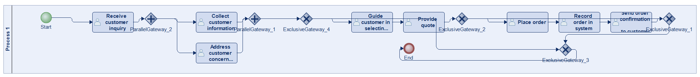
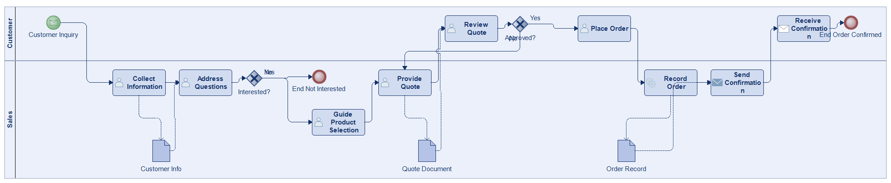

# Scenario 01 — config-helpers / Claude Opus 4.5

**Status:** ✅ executed

Side-by-side comparison with the reference BPMN and the other 5 (approach × LLM) cells: [scenario_01.md](../../../../comparisons/scenario_01.md)

## Reference (ground truth) vs. this run

**Reference BPMN**

**Generated BPMN**

## This run at a glance

| metric | ground truth | generated | Δ |
|---|---:|---:|---:|
| Lanes | 1 | 2 | +1 |
| Elements | 16 | 14 | -2 |
| Gateways | 6 | 2 | -4 |
| Flows | 18 | 14 | -4 |
| Data obj. | 0 | 3 | +3 |
| Data assoc. | 0 | 6 | +6 |

**Generation:** 4,979 tokens · 18.4s · $0.053

## Files in this folder

- [`input_scenario.md`](input_scenario.md) — natural-language prompt
- [`ground_truth.bpmn`](ground_truth.bpmn) — reference BPMN XML
- [`ground_truth.py`](ground_truth.py) — reference Modelio script
- [`ground_truth.png`](ground_truth.png) — rendered reference diagram
- [`generated.py`](generated.py) — LLM output
- [`diagram_generated.png`](diagram_generated.png) — rendered LLM diagram
- [`metrics.json`](metrics.json) — full metric record
- [`execution_output.txt`](execution_output.txt) — Modelio execution log (from the original experiment)
