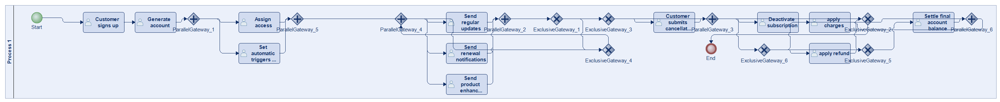

# Scenario 11 — config-helpers / GPT-5.2

**Status:** ⚠️ executed at experiment time, render failed today

Side-by-side comparison with the reference BPMN and the other 5 (approach × LLM) cells: [scenario_11.md](../../../../comparisons/scenario_11.md)

## Reference (ground truth) vs. this run

**Reference BPMN**

**Generated BPMN**

_Render failed: `ERROR: org.modelio.vcore.smkernel.IllegalModelManipulationException: IllegalModelManipulationException [Error: -1, object=null, closure=org.`_  ([log](diagram_render_error.txt))

## This run at a glance

| metric | ground truth | generated | Δ |
|---|---:|---:|---:|
| Lanes | 1 | 3 | +2 |
| Elements | 26 | 23 | -3 |
| Gateways | 12 | 2 | -10 |
| Flows | 33 | 19 | -14 |
| Data obj. | 0 | 5 | +5 |
| Data assoc. | 0 | 7 | +7 |

**Generation:** 5,729 tokens · 31.7s · $0.043

## Files in this folder

- [`input_scenario.md`](input_scenario.md) — natural-language prompt
- [`ground_truth.bpmn`](ground_truth.bpmn) — reference BPMN XML
- [`ground_truth.py`](ground_truth.py) — reference Modelio script
- [`ground_truth.png`](ground_truth.png) — rendered reference diagram
- [`generated.py`](generated.py) — LLM output
- [`metrics.json`](metrics.json) — full metric record
- [`execution_output.txt`](execution_output.txt) — Modelio execution log (from the original experiment)
- [`diagram_render_error.txt`](diagram_render_error.txt) — render failure detail
